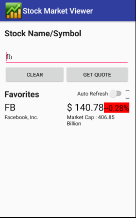
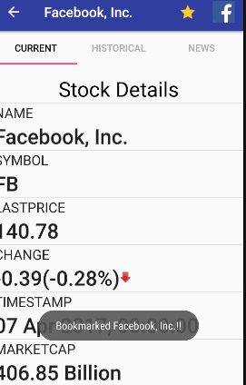
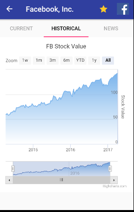

# Stock Search APP for 	Android

It is a android APP used for search stock information.

## About Stock Search APP

It is a android APP that allows users to search for stock information and display the results. People can view the current stock information, the historical information and news about the stock. It help them to decide which stock to buy and manage their own stock. People can also like stocks and even post them to Facebook to give their friends some suggestion on stocks. 

### What You Will Find in Stock Search APP:
1. Input box
2. Favorite list
3. Current page
4. Historical Page
5. News Page
6. Like Button
7. Facebook button

### Screen Shots





## Getting Started

### Clone the Repository

As usual, you get started by cloning the project to your local machine:

```
$ git clone https://github.com/jiayilai/StockSearchAndroidAPP.git
```

### Open and Run Project in Android Studio

Now that you have cloned the repo:

1. open the project up in Android Studio.
2. Click "Run" button.
3. Select the target device, which can be virtual devices or connected devices. Click "OK".
4. The app will be installed to the device.

## Android Version Targeting

Egg is currently built to work with Android API 23. **However**, Egg's minimum SDK support is 15.

## Meta

Jiayi Lai – [LinkedIn](https://www.linkedin.com/in/jiayi-lai/) – Jiayilai@usc.edu

Distributed under the [BSD](https://choosealicense.com/licenses/bsd-2-clause/) license. See ``LICENSE`` for more information.

[https://github.com/jiayilai](https://github.com/jiayilai/)
